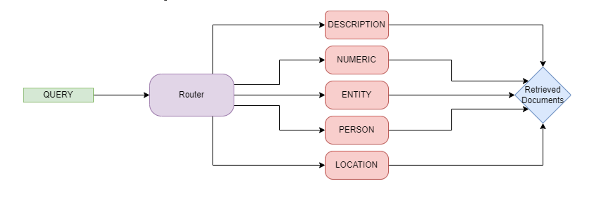
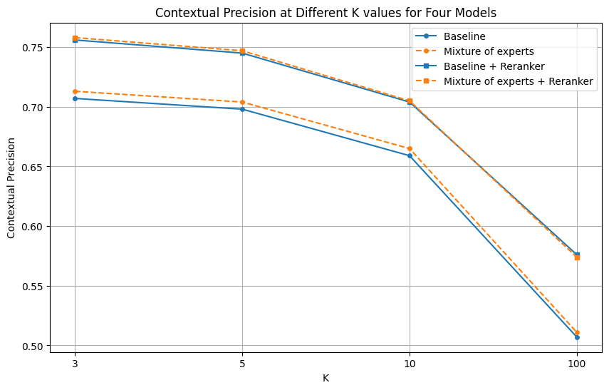
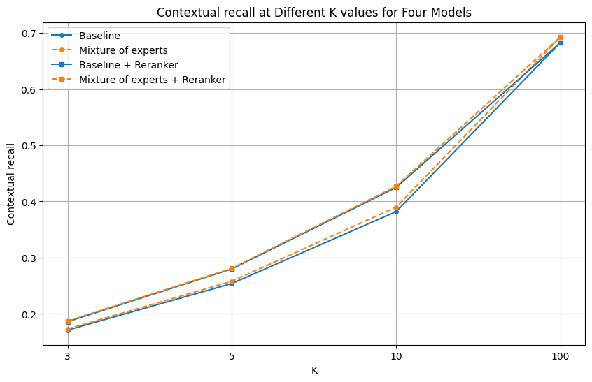
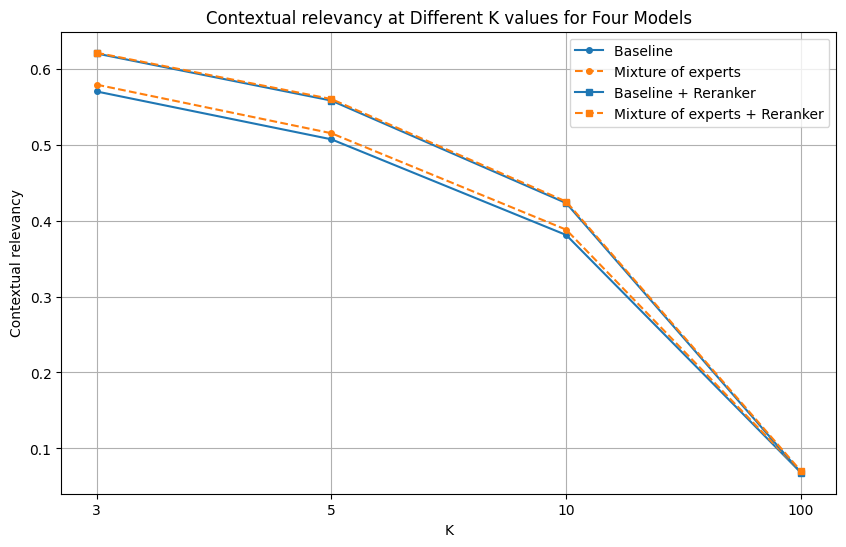

# Better Retrieval for Generation
This project aims to improve retriever performance in a Retrieval-Augmented Generation(RAG) pipeline. This is a course project for the course CS6803: Topics in Natural Language Processing, taught by Dr. Maunendra Desarkar at IIT Hyderabad. This project was developed by Team 15, consisting of:
- [Ankit Saha](https://github.com/Ankit-Saha-2003)
- [Pranav Balasubramanian](https://github.com/Pranavb060504)

## Problem Statement
Retrieving additional contents from a collection for a given context, and using these contents as expanded context can be helpful for various tasks. In this project, you will deal with the retrieval strategies that can fetch good-quality context from existing document pool, given a seed context.

## Dataset
- We are using the [MS MARCO Question Answering(v2.1)](https://huggingface.co/datasets/microsoft/ms_marco) dataset.

- Dataset contains:

    - **query**: Question corresponding to which relevant passages need to be extracted (or) answers need to be generated

    - **query_id**: Unique id for each query

    - **Passages**:  
        - **passage_text**: A list of passages relevant to the corresponding query.  
        - **is_selected**: An array indicating whether each relevant passage is chosen for generating answers, where a value of 1 denotes the passage is selected. 

    - **query_type**: can be one of ['DESCRIPRION', 'NUMERIC', 'ENTITY', 'LOCATION', 'PERSON']
    
    - **answers**: Answers to corresponding queries

- Dataset split:
    | name | train | validation | test |
    |----------|----------|----------|----------|
    | v2.1    | 808731 | 101093	| 101092 |

## Models
 
- Baseline: [sentence-transformers/all-MiniLM-L6-v2](https://huggingface.co/sentence-transformers/all-MiniLM-L6-v2)

- Reranker: [cross-encoder/ms-marco-MiniLM-L-6-v2](https://huggingface.co/cross-encoder/ms-marco-MiniLM-L-6-v2)

- Router:

    - A Two Layer Fully connected neural network (FCNN) with 
        - input_dim: **384** (dimension of the baseline embedding)
        - output_dim: **5** (number of experts)

- Mixture of experts:

    - Ensemble of [2-LayerNN adapter](https://docs.llamaindex.ai/en/stable/examples/finetuning/embeddings/finetune_embedding_adapter/) finetuned retirevers
    - Query passed to the Router
    - Router forwards query to the best expert (Here 5 experts, each expert corresponds to a query type)
    - Passages are retrieved by the best expert, with the option to combine results from multiple experts as per the user's preference.

## Vector Database

- [FAISS](https://python.langchain.com/docs/integrations/vectorstores/faiss/)

## Evaluation metrics

- [Contextual Precision](https://docs.confident-ai.com/docs/metrics-contextual-precision)

- [Contextual Recall](https://docs.confident-ai.com/docs/metrics-contextual-recall)

- [Contextual Relevancy](https://docs.confident-ai.com/docs/metrics-contextual-relevancy)

## Results

- Router classification accuracy:
    - hidden_dim = **128**, accuracy = **0.8837**
    - hidden_dim = **256**, accuracy = **0.8928**

- Baseline metrics:

| k | Contextual Precision | Contextual Recall | Contextual Relevancy| 
|----------|----------|----------|----------|
| 3 | 0.707 | 0.171 | 0.570 |
| 5 | 0.698 | 0.254 | 0.507 |
| 7 | 0.659 | 0.382 | 0.381 |
| 100 | 0.507 | 0.683 | 0.068 |

- Baseline + Reranker metrics:

| k | Contextual Precision | Contextual Recall | Contextual Relevancy| 
|----------|----------|----------|----------|
| 3 | 0.756 | 0.186 | 0.620 |
| 5 | 0.745 | 0.280 | 0.558 |
| 7 | 0.704 | 0.425 | 0.423 |
| 100 | 0.576 | 0.683 | 0.068 |

- Mixture of experts:

| k | Contextual Precision | Contextual Recall | Contextual Relevancy| 
|----------|----------|----------|----------|
| 3 | 0.713 | 0.173 | 0.579 |
| 5 | 0.704 | 0.258 | 0.515 |
| 7 | 0.665 | 0.390 | 0.388 |
| 100 | 0.511 | 0.693 | 0.069 |

- Mixture of experts + Reranker: 

| k | Contextual Precision | Contextual Recall | Contextual Relevancy| 
|----------|----------|----------|----------|
| 3 | 0.758 | 0.187 | 0.621 |
| 5 | 0.747 | 0.281 | 0.560 |
| 7 | 0.705 | 0.427 | 0.425 |
| 100 | 0.574 | 0.693 | 0.070 |

## Plot

 
